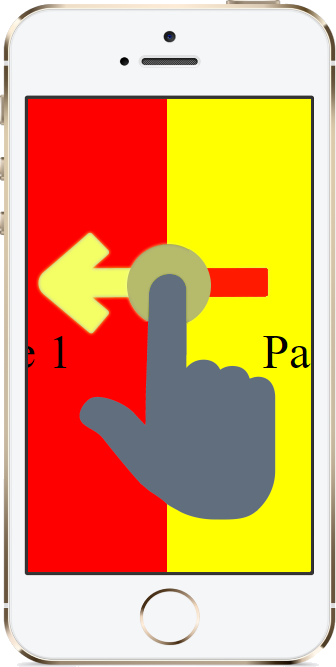
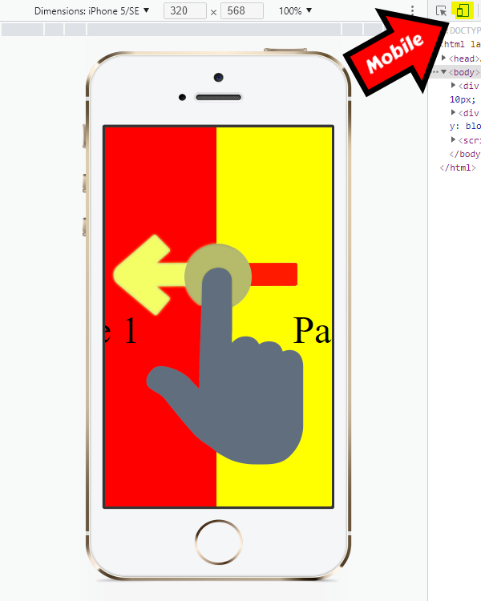

  

<h1 align="center">Swipe Pages in Pure Javascript</h1>

  Swipe Between Two Pages using Vanilla JS.

## 🧐 About 

Transcription of the code from [swipe pages in pure javascript](https://www.youtube.com/watch?v=bV9idMbioqg) by [Real Project Mastery](https://www.youtube.com/channel/UCm8qqU47OfA_3jforf37cwg).

## 📘 Preview 

The preview is available on [marfullsen.rocks/swipe-pages-effect-js/](https://marfullsen.github.io/swipe-pages-effect-js/)

## 🔧 Desktop browsers 

To test on a desktop browser, go to **DevTools**, and then click on *Toggle device toolbar*.

## 🎉 References 

- [Swipe pages in pure javascript](https://www.youtube.com/watch?v=bV9idMbioqg)
- [The Touch Event](https://www.w3schools.com/jsref/obj_touchevent.asp)